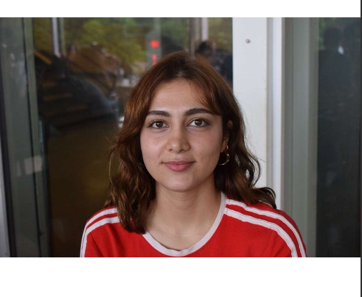

# Merhaba!

{ .foto }

Ben Melisa. İTÜ'de Moleküler Biyoloji ve Genetik okuyorum ve birinci sınıftan beri aklım fikrim biyoinformatikte. Pipetle klavye arasında bir yerde yaşıyorum; ikisini de seviyorum ama itiraf edeyim, klavye tarafı ağır basıyor.

Bu siteyi neden kurdum? Çünkü bence **biyoinformatik proje yaparak öğrenilir.** Oturup kitabını okumak, terimleri ezberlemek, "hizalama nedir" sorusuna üç tanım yazabilir hale gelmek... En azından benim için mantıklı bir yol değildi bu. Ezberlediğim terimi ertesi gün unutuyordum; ama bir FASTQ dosyasını ilk kez kendim açtığımda, ilk volkan grafiğimi kendim çizdiğimde, kod hata verip de bir saat uğraşıp çözdüğümde öğrendiklerim hâlâ yerli yerinde duruyor. Yüzme gibi: kıyıdan izleyerek olmuyor, suya gireceksin. Ben de "suya girerek öğrenilecek bir yer olsun" diye bu siteyi kurdum.

Peki burada ne var?

**Projeler.** Altı gerçek proje, gerçek verilerle. Her proje bir biyolojik soruyla başlıyor ("bu geni susturunca ne değişiyor?" gibi), ham veriyle suya giriyoruz ve her adımın *nedenini* konuşa konuşa yorumlanmış sonuca çıkıyoruz. Komut satırı, Python, istatistik; ne gerekiyorsa yolda öğreniyoruz, çünkü gerçek hayatta da öyle öğreniliyor.

**Analiz Atlası.** Bir makalede adını görüp "bu neydi şimdi" dediğiniz analizler var ya; işte onlardan 76'sı için birer kart: nedir, hangi soruyu cevaplar, ne zaman kullanılır, hangi araçlarla yapılır. Kafanızda beş dakikada yerine otursun diye.

Kimler için? Temel düzeyde Python biliyorsanız çok rahat edersiniz; bilmiyorsanız da dert değil, ilk rehberler sıfırdan alıyor. Tek gerçek ön koşul merak.

Son bir dürüstlük: ben bu işin hocası değilim, yol arkadaşıyım. Bu projeleri yaparken ben de öğreniyorum ve takıldığım her yeri rehberlere not düşüyorum. Bir hata görürseniz söyleyin; teşekkür edip düzeltirim. Bu sitede yanlış bilginin durmasındansa "bunu henüz bilmiyorum" yazması yeğdir.

Çünkü verilerden öğrenecek çok şeyimiz var. Hadi başlayalım.

## Bana ulaşın

- E-posta: mbmelisaa@gmail.com · agrim22@itu.edu.tr
- [LinkedIn](https://www.linkedin.com/in/melisa-a%C4%9Fri-117353312/)
- [GitHub](https://github.com/melissa-04) — hata bildirimi ve öneriler için
