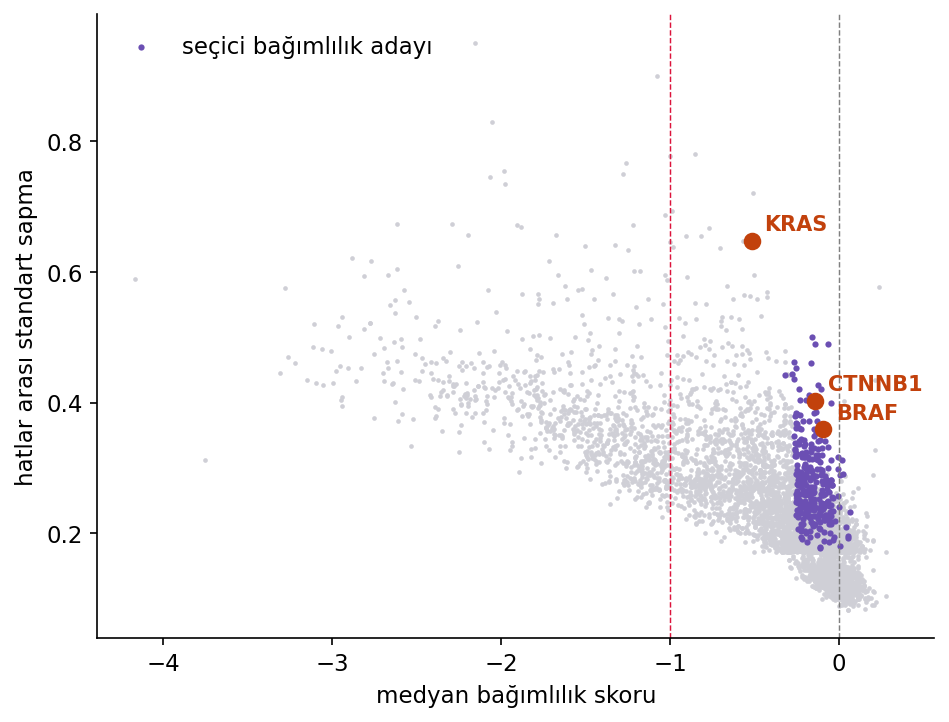

# 4 · DepMap / CRISPR ekranları

!!! question "Projenin sorusu"
    Genom çapında nakavt yapıldığında hangi genler hangi kanser hücre hatlarında yaşamsal çıkıyor — ve bu, hedef gen seçimi için ne anlama geliyor?

Serinin dördüncü projesi öncekilerden farklı: ham okuma, hizalama, sayım yok. Broad Institute'un DepMap projesi 1.208 kanser hücre hattında genom çapında CRISPR-Cas9 nakavt ekranı yapmış ve sonuçları hazır bir tablo olarak yayımlamış. Buradaki beceri boru hattı kurmak değil, büyük bir tabloya doğru soruları sormak: pandas ve görselleştirme ağırlıklı, saf veri analizi.

**Veri:** DepMap Public 25Q2'den türetilmiş ders alt kümesi — 1.208 hücre hattı × 5.000 gen. Kendi DOI'sinde yayımlandı: [10.5281/zenodo.22759375](https://doi.org/10.5281/zenodo.22759375). Defterler veriyi doğrudan oradan okur; kurulum gerekmez, dosya indirmezsiniz.

**Araçlar:** pandas, numpy, matplotlib/seaborn.

*Her nokta bir gen. İyi ilaç hedefleri sol alt köşede değil, mor bölgede aranır.*

## Çekirdek yol

1. **Veri mutfağı** — CRISPR ekranı çıktısını tanımak, Chronos skorunun ölçeği, alt kümenin çıkarılması ve arşivlenmesi
2. **Tabloyu tanımak** — skorların dağılımı, ortak esansiyel genler ile etkisiz genlerin ayrımı
3. **Bir genin profili** — seçilen bir genin bütün hatlardaki skoru; dağılıma bakmadan hüküm yok
4. **Seçici bağımlılıklar** — "her yerde ölümcül" ile "yalnız bu kanserde ölümcül" farkı; iyi hedef hangisi?
5. **Bağımlılığın nedeni** — bağımlılığı mutasyon ve ifade ile ilişkilendirmek, sentetik letalite kavramı
6. **Kapanış** — kendi seçtiğiniz genin ya da kanser tipinin analizi

## İleri modüller

Çekirdek yol tamamlandıkça eklenecek derinleşmeler:

MAGeCK ile ham ekran analizi · Ko-esansiyellik ağları · Halka açık veriyle Perturb-seq'e giriş
