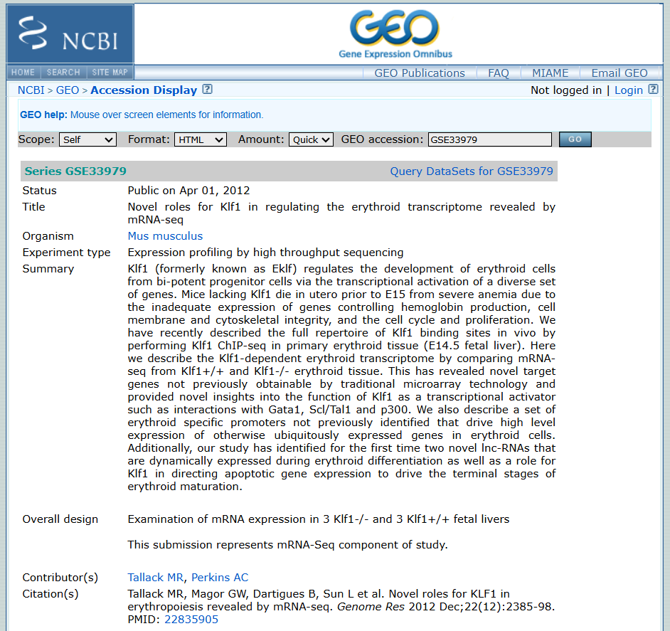
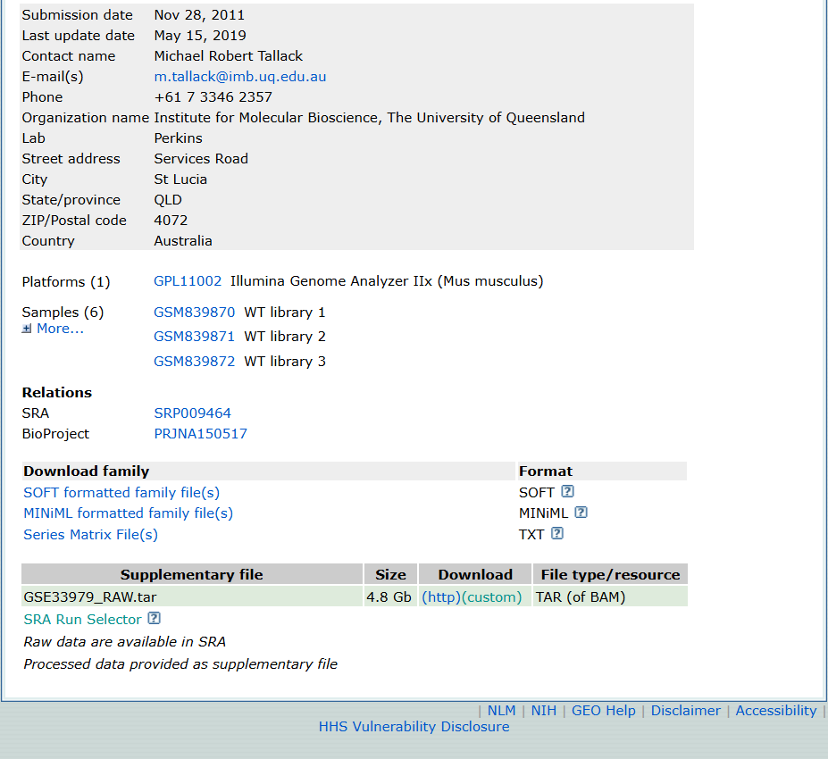

# Veri: sayılar nereden geliyor?

Bu projede kullandığınız her dosyanın kaynağı bu sayfada. Hiçbir adımı saklamadım; isteyen her şeyi sıfırdan yeniden üretebilir.

## Deneyin kimliği

Tallack ve arkadaşlarının 2012'de Genome Research'te yayımladığı çalışmayla çalışıyoruz: "Novel roles for KLF1 in erythropoiesis revealed by mRNA-seq" (PMID: 22835905). GEO kaydı **GSE33979**, SRA kaydı **SRP009464**. Tasarım: üç Klf1−/− (knockout) ve üç Klf1+/+ (yabani tip) BALB/c fare, E14.5 fetal karaciğer; tek uçlu 76 baz okumalar, Illumina GAIIx. Veri 2011'de üretilmiş; eski ama tasarımı ders kitabı gibi temiz olduğu için seçtim.

## GEO sayfası nasıl okunur?

Ben de bu işe GEO sayfasını sökmekle başladım. Aşağıda sayfanın iki kritik bölgesini görüyorsunuz; her satırın ne anlama geldiğini görsellerin altında tek tek açıklıyorum.

**Series GSE33979:** veri setinin GEO kimliği; "Series" bir çalışmanın tamamı demek. **Status:** verinin herkese açıldığı tarih. **Title:** çalışmanın başlığı, makaleyle aynı. **Organism:** fare. **Experiment type:** GEO'nun "RNA-seq" deme biçimi. **Summary:** yazarların özeti; deneyin biyolojik hikâyesi burada. **Overall design:** deney tasarımı; bizim için en önemli satır: 3 knockout, 3 yabani tip. **Citation:** veriyi kullanırken atıf yapılacak makale.

**Contact / Lab:** veriyi üreten laboratuvar (Perkins Lab, Queensland Üniversitesi); soru sorulacak adres. **Platforms:** dizileme cihazı; 2011 teknolojisi, kısa okumalar. **Samples (6):** her GSM bir örnek; "More..." tıklanınca altısı da görünür. **SRA — SRP009464:** ham okumaların (FASTQ) durduğu arşiv; veriyi asıl buradan indirdim. **BioProject:** çalışmanın NCBI'daki şemsiye kaydı. **SOFT / MINiML / Series Matrix:** örnek bilgilerini içeren üst veri dosyaları; ifade sayımı değil. **Supplementary file — GSE33979_RAW.tar (4.8 Gb):** yazarların işlenmiş verisi, hizalanmış okuma dosyaları (BAM); hazır sayım tablosu yok, bu yüzden sayımı kendim ürettim. **SRA Run Selector:** her örneğin run kodunu ve boyutunu listeleyen araç.

Ekran görüntüleri: NCBI GEO, GSE33979.

## Altı örnek

| Örnek | Run | GSM | Genotip | Baz (G) |
|---|---|---|---|---|
| WT_1 | SRR384977 | GSM839870 | Klf1+/+ | 1,52 |
| WT_2 | SRR384978 | GSM839871 | Klf1+/+ | 1,69 |
| WT_3 | SRR384979 | GSM839872 | Klf1+/+ | 3,42 |
| KO_1 | SRR384980 | GSM839873 | Klf1−/− | 1,91 |
| KO_2 | SRR384981 | GSM839874 | Klf1−/− | 2,00 |
| KO_3 | SRR384982 | GSM839875 | Klf1−/− | 1,98 |

Dikkatinizi çekeyim: WT_3'ün derinliği diğerlerinin yaklaşık iki katı. Örnekler eşit derinlikte dizilenmemiş; ham sayıların neden doğrudan karşılaştırılamayacağını normalizasyon rehberinde tam bu örnekle konuşacağız.

## Küçültülmüş veri (rehberlerde kullandığınız dosyalar)

Tam veri 8 GB'a yakın; Colab'da bununla boğuşmak eziyet. Her örneğin ilk 1 milyon okumasını alıp ayrı dosyalara koydum. Bu **konumsal** bir alt küme (dosyanın başı, rastgele değil): kalite kontrol ve kantifikasyon adımlarını göstermeye yeter, diferansiyel ifade analizi için kullanılmaz.

Paket Zenodo'da: **DOI [10.5281/zenodo.22206786](https://zenodo.org/records/22206786)**. İçinde altı FASTQ, örnek tablosu (ornekler.csv) ve bütünlük kontrolü için md5sum.txt var. Defterler veriyi oradan kendileri indirir; sizin bir şey yapmanız gerekmez. Küçültme adımlarının tamamı [mutfak defterlerinde](https://github.com/melissa-04/melisayla-biyoinformatik/tree/main/notebooks/rna-seq/mutfak).

## Tam sayım tablosu nasıl üretildi?

İstatistik rehberlerinin tamamı tek dosyayla çalışır: [sayim_tablosu.csv](https://github.com/melissa-04/melisayla-biyoinformatik/blob/main/data/rna-seq/sayim_tablosu.csv). Üretimi şöyle: altı örneğin tam FASTQ'ları ENA'dan indirildi, **Salmon 1.10.0** ile GENCODE **vM35** fare transkriptomuna karşı sayıldı (`--gencode` bayrağıyla, decoy'suz indeks) ve transkript sayıları genlerinde toplandı; komutların tamamı yine mutfak defterlerinde. Eşleşme oranları:

| Örnek | Eşleşme (%) |
|---|---|
| WT_1 | 67,9 |
| WT_2 | 53,7 |
| WT_3 | 71,9 |
| KO_1 | 48,8 |
| KO_2 | 69,8 |
| KO_3 | 53,3 |

Modern verilerde %85–95 görmeye alışığız; 2011'in kimyası için %50–70 bandı şaşırtıcı değil ama yine de not düşülmeyi hak ediyor.

## Verinin huyları (bilmeden yorum yapmayın)

Her verinin huyu vardır; bunlar bizimkinin bilinenler listesi. Birincisi, RNA'lar dizilenmeden önce **GLOBINclear** kitiyle alfa- ve beta-globin mRNA'sından arındırılmış; yani Hbb ve Hba genlerinin sayıları biyolojik ölçüm değildir, o satırlara bakıp hüküm kurmayın. İkincisi, KO_1 ve KO_3 dosyaları aynı okuma sayısına rağmen diğerlerinden neredeyse iki kat büyük ve en düşük eşleşme oranları da onlarda; iki gözlem aynı yöne, o kütüphanelerin daha gürültülü olduğuna işaret ediyor. Nedenini kalite kontrol rehberinde FastQC ile araştıracağız; şimdilik dürüst cevap "henüz bilmiyorum". Üçüncüsü, indeksimiz decoy'suz; en iyi uygulama transkriptoma genomu da yem olarak eklemektir, Colab'ın belleği yetmediği için eklemedik. Verilerden öğrenecek çok şeyimiz var; bu sayfa da öğrendikçe güncellenecek.
