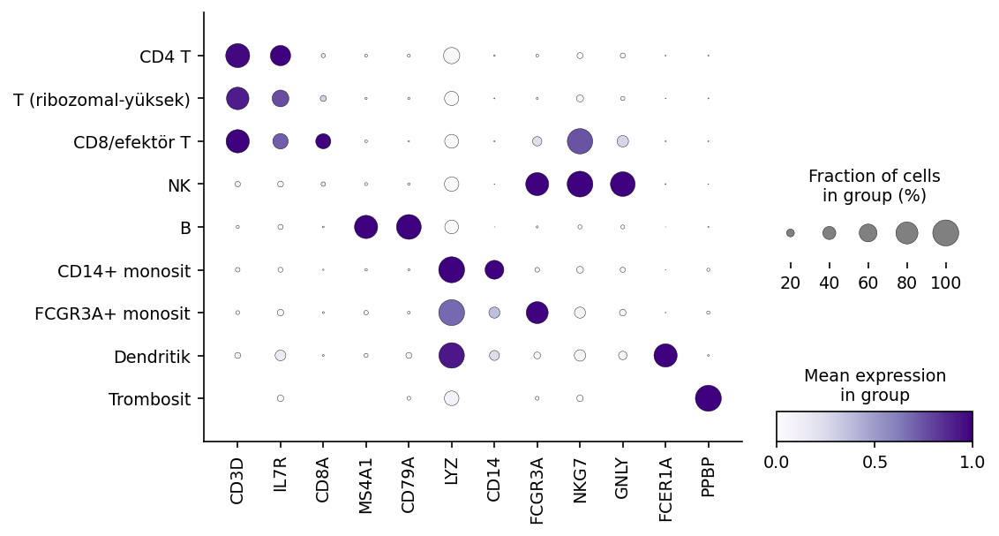

# 2 · Tek hücre: PBMC

Serinin ikinci projesi: 10x Genomics'in klasik PBMC3k seti üzerinden, veri mutfağından hücre tiplerinin adlandırılmasına uzanan bir tek hücre RNA-seq yolculuğu. Birinci projenin kapanış sorusunu — toplu ortalama bizden ne sakladı? — bu proje cevaplayacak. Soldaki 2.1'den başlayın; defterler Colab'da açılır ve veri, DOI'li kalıcı adresinden okunur.

*Kimlik kanıtı: her hücre tipi kendi işaretçi genlerinde koyu ve büyük nokta veriyor.*
